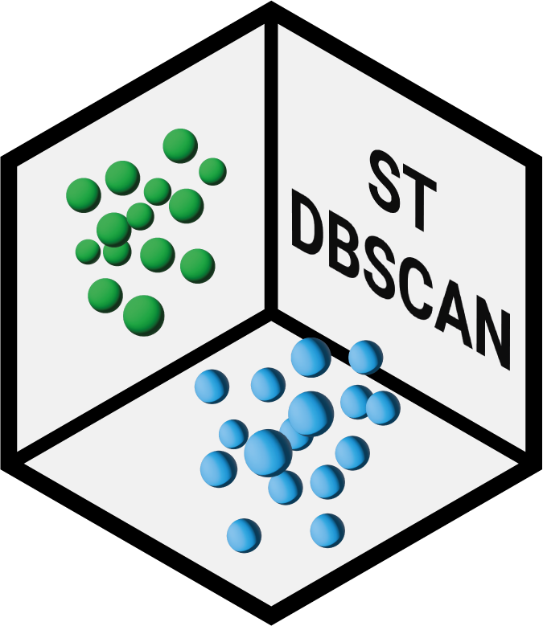

# stdbscan

<!-- badges: start -->
[](https://lifecycle.r-lib.org/articles/stages.html#experimental)
[](https://app.codecov.io/gh/MiboraMinima/stdbscan)
[](https://CRAN.R-project.org/package=stdbscan)
[](https://cran.r-project.org/package=stdbscan)
[](https://github.com/MiboraMinima/stdbscan/actions/workflows/R-CMD-check.yaml)
<!-- badges: end -->

## Overview

`stdbscan` implements the ST-DBSCAN (**S**patio-**T**emporal DBSCAN) algorithm
developped by Birant & Kut (2007). It extends DBSCAN by adding a temporal
parameter that allows spatio-temporal clustering.

For performance and compatibility, this package heavily rely on
[`dbscan`](https://github.com/mhahsler/dbscan). All CPU consumming functions are
written in C++ via [`Rcpp`](https://www.rcpp.org/).

## Installation

You can install the released version of `stdbscan` from
[CRAN](https://CRAN.R-project.org/package=stdbscan) with:

```r
install.packages("stdbscan")
```

And the development version from GitHub with:

```r
# install.packages("devtools")
devtools::install_github("MiboraMinima/stdbscan")
```

## Usage

An example of the application of `stdbscan` is available in the
[vignette](https://miboraminima.github.io/stdbscan/articles/stop-identification.html)
on stop identification.

## Breaking changes

- In version `0.2.0`, `st_dbscan()` uses a `matrix` as input instead of raw `x`,
`y` and `t` variables.

## Problems and Issues

- Please report any issues or bugs you may encounter on the [dedicated
  page on github](https://github.com/MiboraMinima/stdbscan/issues).

## System Requirements

`stdbscan` requires [`R`](https://cran.r-project.org) v \>= 3.5.0.

## Alternatives

`R` :

- [ST-DBSCAN](https://github.com/CKerouanton/ST-DBSCAN)
- [stdbscanr](https://github.com/gdmcdonald/stdbscanr)

`python` :

- [st_dbscan](https://github.com/eren-ck/st_dbscan)
- [py-st-dbscan](https://github.com/eubr-bigsea/py-st-dbscan)

## References

Birant, D., & Kut, A. (2007). ST-DBSCAN: An algorithm for clustering
spatial–temporal data. *Data & Knowledge Engineering*, 60(1), 208–221.
<https://doi.org/10.1016/j.datak.2006.01.013>
